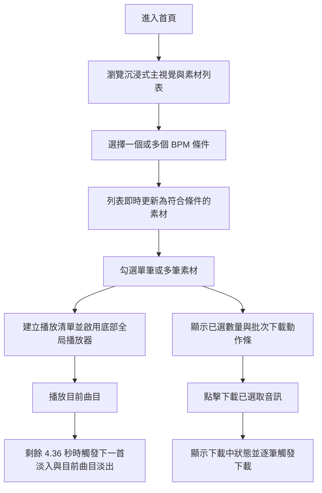

## 1. 產品概述
這是一個個人用的「音樂創作與專注力環境」網站，聚焦於在深色沉浸式空間中快速篩選、建立播放清單、連續播放與批次下載專注音樂素材。
- 主要解決個人創作或深度工作時，素材管理分散、播放銜接不順、下載操作繁瑣的問題。
- 產品價值在於將「氛圍」、「清單播放」、「無痕 crossfade」、「篩選」與「下載」整合為單頁體驗，降低切換成本並提升專注感。

## 2. 核心功能

### 2.1 功能模組
1. **首頁**：沉浸式主視覺、BPM 多選篩選、素材網格、批次下載動作條、全局播放器。

### 2.2 頁面詳情
| 頁面名稱 | 模組名稱 | 功能說明 |
|-----------|-----------|-----------|
| 首頁 | Hero 主視覺 | 顯示全螢幕背景圖、深色遮罩、品牌標題與環境定位文案，營造 CEO Mindset 專注氛圍。 |
| 首頁 | BPM 篩選列 | 保留可複選的 BPM 篩選介面，初始資料雖全為 110 BPM，仍需支援即時篩選邏輯供後續擴充。 |
| 首頁 | 選取工具列 | 提供全選、取消全選、已選數量資訊與批次下載操作。 |
| 首頁 | 素材卡片網格 | 以單欄或 2 至 3 欄 CSS Grid 顯示 5 筆素材，呈現封面、標題、BPM、提示詞與核取方塊。 |
| 首頁 | 全局播放器 | 固定在畫面底部，控制勾選後形成的播放清單，顯示目前播放曲目、下一首資訊與播放狀態。 |
| 首頁 | 無痕轉場引擎 | 使用 `howler.js` 在目前曲目剩餘 4.36 秒時，觸發下一首淡入與當前曲目淡出，形成物理對拍的 crossfade。 |
| 首頁 | 批次下載動作條 | 使用者勾選素材後顯示固定動作條，可觸發逐筆下載並提供 Loading 與 Spinner 狀態。 |

## 3. 核心流程
使用者進入首頁後先感受沉浸式環境，接著可依創作節奏勾選 1 個以上 BPM 篩選條件，快速縮小素材範圍。使用者可勾選多筆素材建立播放清單，並交由固定底部的全局播放器連續播放。當目前曲目進入倒數 4.36 秒時，系統需自動觸發下一首淡入、目前曲目淡出，讓同 BPM 曲目以兩小節長度精準重疊。使用者也可透過頂部操作或底部動作條執行批次下載，下載期間介面需清楚顯示處理中狀態，避免重複點擊。

## 4. 使用者介面設計
### 4.1 設計風格
- 主色：近黑色、石墨灰、煙霧藍灰。
- 輔色：低飽和金屬銀、微光青色作為 hover 或 focus 強調。
- 按鈕風格：圓角膠囊按鈕，深色半透明底搭配細邊框與毛玻璃效果。
- 字體建議：標題使用具高端雜誌感的襯線或現代展示字，內文使用高可讀性的現代無襯線字體。
- 佈局風格：桌面優先，主視覺與控制列置頂，素材以卡片式網格呈現。
- 圖示風格：細線條、簡約、科技感，避免可愛或過度娛樂化元素。

### 4.2 頁面設計總覽
| 頁面名稱 | 模組名稱 | UI 元素 |
|-----------|-----------|-----------|
| 首頁 | Hero 主視覺 | 全螢幕背景圖、深色 overlay、漸層光暈、標題、簡短副標、狀態標籤。 |
| 首頁 | BPM 篩選列 | 多選 chips、已啟用狀態、hover/focus 高亮、即時統計數量。 |
| 首頁 | 素材卡片 | 毛玻璃容器、封面縮圖、BPM 標籤、提示詞區塊、核取方塊、播放清單加入狀態。 |
| 首頁 | 全局播放器 | 固定底部控制列、播放／暫停、目前曲目、下一首曲目、crossfade 狀態提示。 |
| 首頁 | 批次下載動作條 | 固定或黏附式條狀容器、下載按鈕、Loading 文案、Spinner、已選數量顯示。 |

### 4.3 響應式設計
- 採桌面優先設計，`md` 以上使用 2 至 3 欄網格。
- 手機版維持單欄垂直排列，確保卡片與播放器操作區足夠點擊。
- 篩選列與頂部操作區在小螢幕可換行，避免水平捲動。
- 全局播放器與批次下載動作條需避免互相遮擋；手機版採垂直堆疊或安全間距設計。
