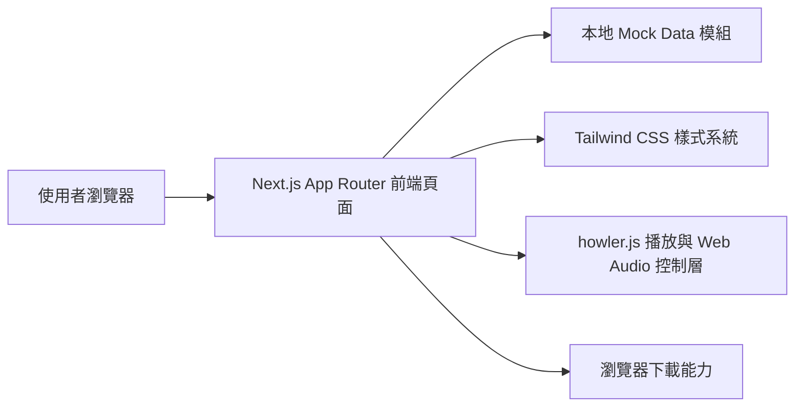
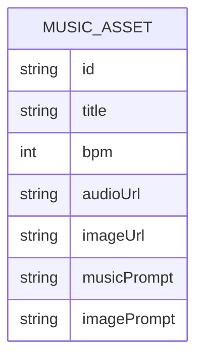

## 1. 架構設計


## 2. 技術說明
- 前端：Next.js 15 + React 19 + TypeScript + Tailwind CSS。
- 路由架構：App Router。
- 音訊播放：`howler.js`，禁止使用原生 HTML5 `<audio>` 標籤作為播放介面。
- 狀態管理：React `useState`、`useMemo`、`useRef`。
- 資料來源：本地 `mock` 陣列，不串接後端與資料庫。
- 播放策略：使用全局播放器管理播放清單與 crossfade 排程。
- 下載策略：前端以 JavaScript 動態建立 `<a download>` 並逐筆觸發。

## 3. 路由定義
| 路由 | 用途 |
|------|------|
| / | 音樂創作與專注力環境首頁，承載 Hero、篩選器、素材卡片、全局播放器與批次下載功能。 |

## 4. API 定義
本專案為純前端展示與互動頁面，初版不建立自訂 API Route。

### 4.1 TypeScript 型別
```ts
export type MusicAsset = {
  id: string;
  title: string;
  bpm: 110;
  audioUrl: string;
  imageUrl: string;
  musicPrompt: string;
  imagePrompt: string;
};
```

### 4.2 前端互動資料結構
```ts
type SelectedState = Record<string, boolean>;

type FilterState = number[];

type DownloadState = {
  isDownloading: boolean;
  selectedCount: number;
};

type PlaybackState = {
  currentTrackId: string | null;
  nextTrackId: string | null;
  isPlaying: boolean;
  crossfadeWindowSeconds: 4.36;
};
```

## 5. 伺服端架構圖
本專案初版不含自訂後端，故不建立 Controller / Service / Repository 分層。

## 6. 資料模型
### 6.1 資料模型定義


### 6.2 前端檔案規劃
| 路徑 | 用途 |
|------|------|
| `src/app/page.tsx` | 首頁組裝與區塊配置。 |
| `src/components/filter-bar.tsx` | BPM 多選篩選器與全選控制。 |
| `src/components/media-card.tsx` | 單筆素材卡片顯示。 |
| `src/components/global-player.tsx` | 固定底部全局播放器與播放控制 UI。 |
| `src/components/selection-action-bar.tsx` | 已選素材的批次下載動作條。 |
| `src/data/music-assets.ts` | 5 筆 Mock Data。 |
| `src/lib/howler-playlist.ts` | `howler.js` 播放清單、fade 與事件管理。 |
| `src/types/music.ts` | 共用型別定義。 |

## 7. 實作原則
- 所有包含互動邏輯的元件檔案頂部必須加入 `'use client'`。
- 採元件拆分，避免將所有狀態與 UI 寫入單一頁面檔案。
- 以 `useMemo` 計算過濾後列表、播放清單與已選數量，降低重算成本。
- 以 `useRef` 儲存 Howler 實例與 timeout 參照，避免 re-render 造成重疊播放或 memory leak。
- Crossfade 邏輯固定採 4.36 秒交疊，於目前曲目剩餘時間小於等於 4.36 秒時預先啟動下一首。
- 下載流程需顯示 `Loading` 狀態，並在完成後回復可操作狀態。
- 視覺層使用深色背景、overlay、glassmorphism 與高端沉浸式動態細節。
- 圖片先以本地靜態路徑佔位，後續可再替換為實際生成素材。
